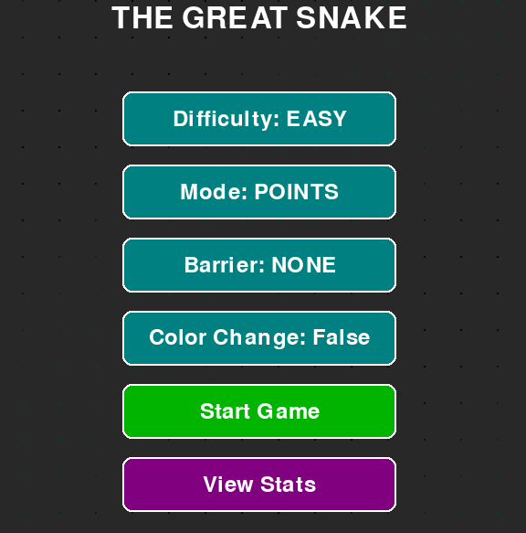
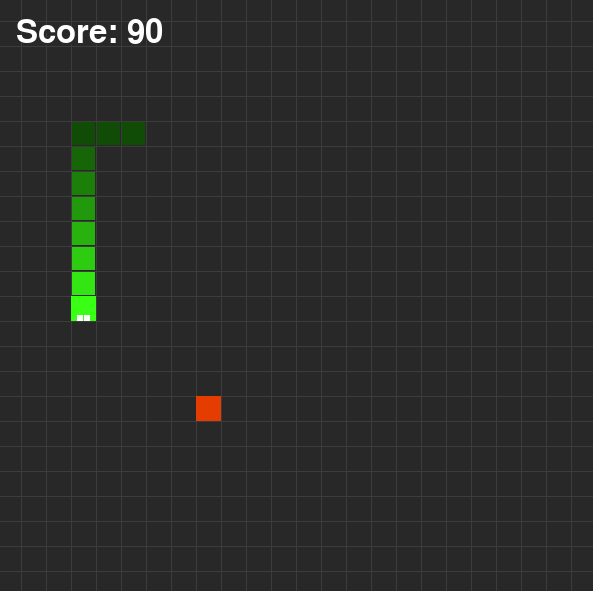
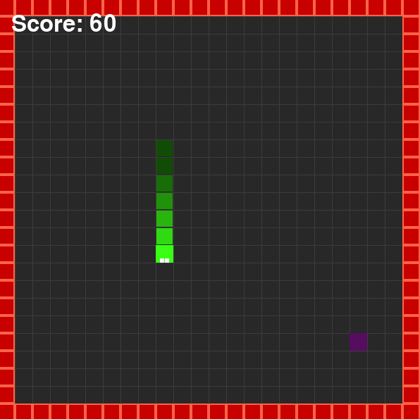
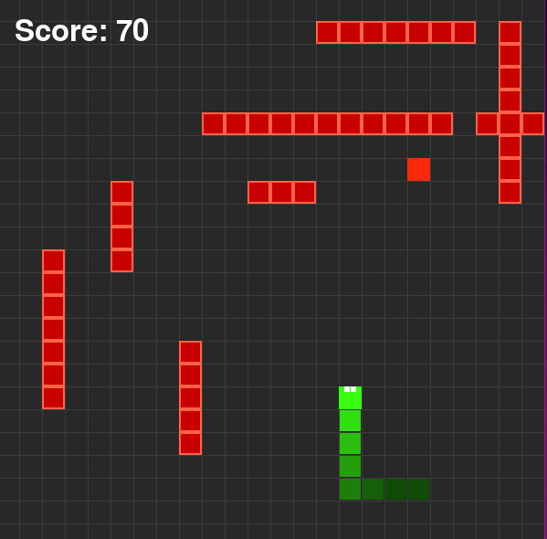
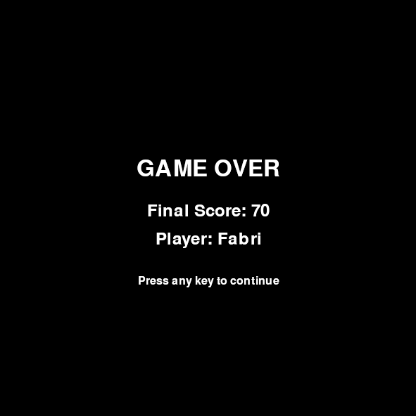
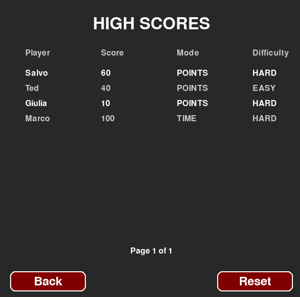

# The Great Snake Game

**The Great Snake Game** is an advanced implementation of the classic Snake game developed in Python using the Pygame library. This modern version features multiple game modes, difficulty levels, barrier types, customizable aesthetics, and a comprehensive statistics tracking system.

## Features

### Game Modes
- **Points Mode**: Play until you lose, trying to achieve the highest score
- **Time Mode**: Race against the clock with a 3-minute time limit

### Difficulty Levels
- **Easy**: Slower snake movement for beginners
- **Medium**: Balanced speed for casual players
- **Hard**: Fast snake movement for experienced players

### Barrier Types
- **None**: Classic mode with wrap-around edges (snake passes through walls)
- **Border**: Walls around the perimeter that end the game on collision
- **Random**: Randomly generated internal barriers that must be avoided

### Visual Effects
- **Color Change**: Option to have the snake change color when eating food
- **Particle Effects**: Dynamic particles appear when food is consumed
- **Pulsing Food**: Food glows with animated colors
- **Snake Gradient**: Snake body features a gradient effect

### Statistics System
- Track player names, scores, and game settings
- Persistent storage using JSON
- View and reset high scores
- Pagination for browsing large numbers of records

## Dependencies

To run the game, the following libraries are required:

- Python 3.x
- Pygame
- Random (built-in)
- Time (built-in)
- JSON (built-in)
- Math (built-in)
- Enum (built-in)
- Dataclasses (built-in)
- Typing (built-in)

You can install Pygame using pip:

```bash
pip install pygame
```

## Installation

1. Clone or download this repository
2. Ensure Python 3.x is installed on your system
3. Install Pygame as described above
4. Run the game

## How to Play

Run the main file:

```bash
python snake.py
```

From the main menu, you can configure:
- Difficulty (Easy, Medium, Hard)
- Game Mode (Points, Time)
- Barrier Type (None, Border, Random)
- Color Change (True, False)

### Controls
- **Arrow Keys**: Control the snake's direction
- **ESC**: Quit current game
- **Mouse**: Navigate menus and change settings

### Gameplay Rules
- Eat food to increase your score
- Avoid collisions with barriers and the snake's own body
- In Border mode, hitting walls ends the game
- In Time mode, you have 3 minutes to get the highest score possible

## Technical Details

### Game Architecture

1. **Button Class**
   - Handles clickable UI elements
   - Manages hover states and click detection
   - Renders text and backgrounds with border radius

2. **Game Class**
   - Manages the game state and logic
   - Handles input processing and collision detection
   - Renders all game elements
   - Implements the main game loop

3. **Food System**
   - Dynamic food generation with fallback strategies
   - Avoids placing food on barriers or the snake
   - Creates visual effects when consumed

4. **Particle System**
   - Generated when food is eaten
   - Particles fade out over time
   - Creates dynamic visual feedback

5. **Statistics System**
   - Saves player data in JSON format
   - Implements pagination for browsing records
   - Allows for data reset

## Data Storage

The application stores game statistics in a local file:
- File name: `snake_stats.json`
- Format: JSON
- Content: List of dictionaries containing player names, scores, game modes, difficulties, and durations
- Auto-saves after each game

## Screenshots

### Main Menu


### Gameplay - Standard Mode


### Gameplay - Border Mode


### Gameplay - Random Barriers Mode


### Game Over Screen


### Statistics Screen


## Contributions

Contributions are welcome! Feel free to:
- Open issues for bugs or suggestions
- Submit pull requests with improvements
- Help with documentation
- Share your experience playing the game

## License

This project is licensed under the MIT License --->  [](https://opensource.org/licenses/MIT)
